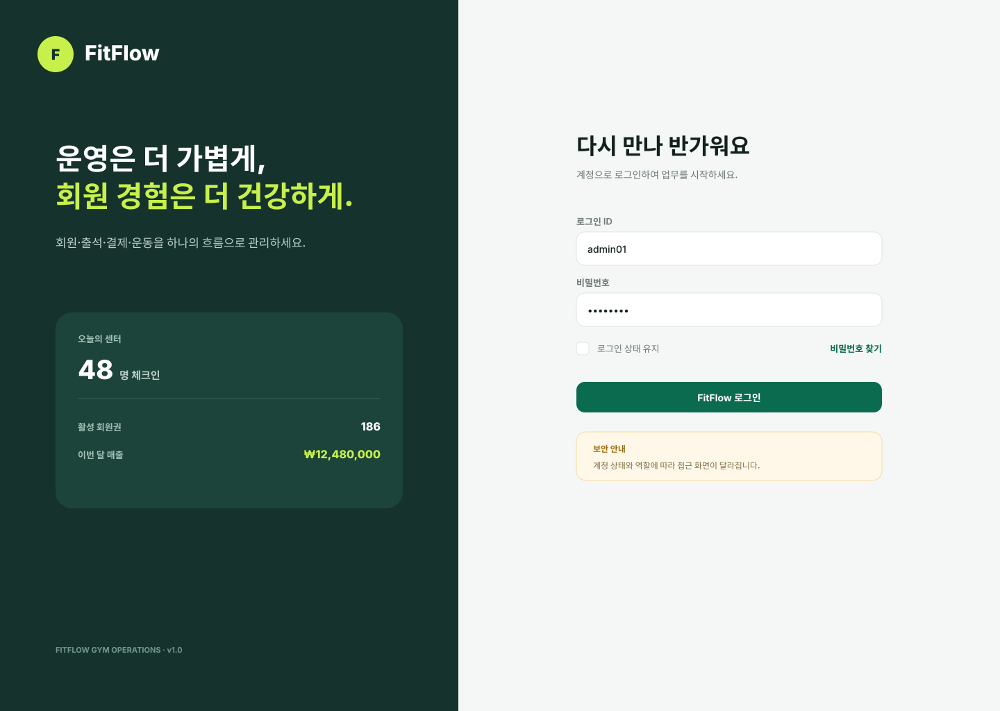
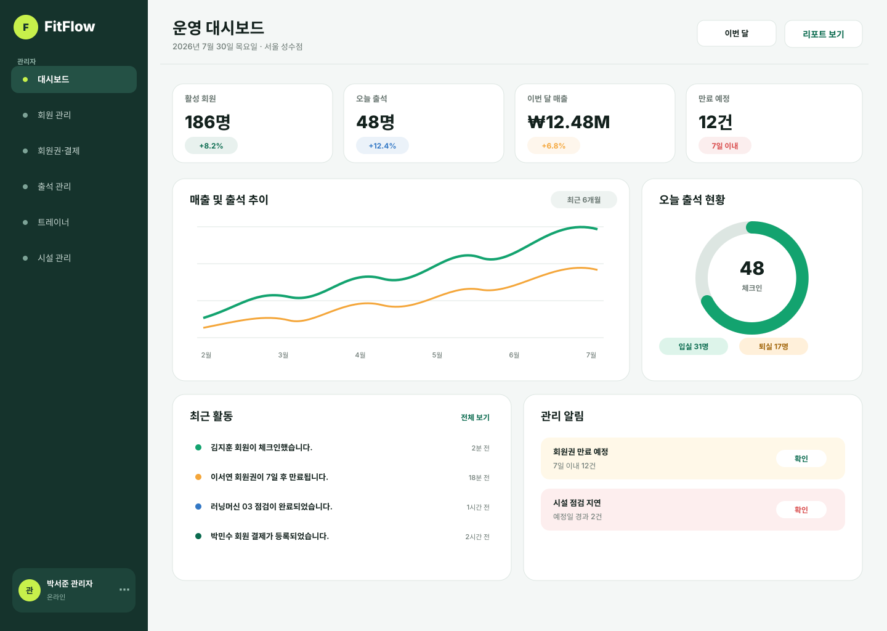
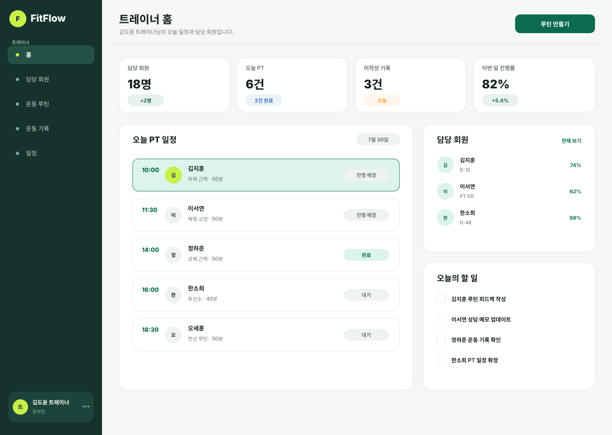
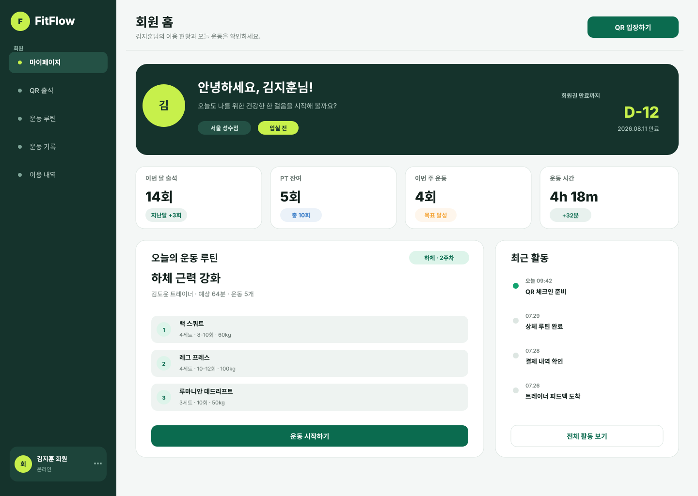

# FitFlow

FitFlow는 헬스장 운영에 필요한 회원, 회원권·결제, 출석, 운동 관리 기능을 한곳에서 관리하는 웹 애플리케이션입니다. 관리자·트레이너·회원 역할별 화면과 권한을 제공하는 것을 목표로 개발하고 있습니다.

> 현재 개발 진행 중인 프로젝트입니다. 일부 화면과 기능은 구현·고도화 단계에 있습니다.

## 주요 기능

### 관리자

- 회원 등록 및 회원 정보 관리
- 회원권 상품, 결제·환불 내역 관리
- 출석 현황 및 운영 대시보드 조회
- 트레이너와 시설 관리

### 트레이너

- 담당 회원 조회 및 회원별 운동 관리
- 운동 루틴 작성·수정
- 일일 운동 기록 확인

### 회원

- 회원권 조회 및 결제 주문
- QR 기반 출석 체크인·체크아웃
- 운동 루틴·기록 조회 및 프로필 관리

## 기술 스택

| 구분 | 기술 |
| --- | --- |
| Backend | Java 17, Spring Boot 4, Spring MVC |
| Security | Spring Security |
| Persistence | MyBatis, MySQL |
| Frontend | Thymeleaf, HTML, CSS, JavaScript |
| Build & Test | Gradle, JUnit |

## 아키텍처

기능별 도메인 패키지 구조를 사용하며, 기본 처리 흐름은 다음과 같습니다.

```text
Controller → Service → Mapper → XML Mapper → MySQL
```

- Controller: 요청·응답, 입력 검증, 화면 및 API 처리
- Service: 비즈니스 로직과 트랜잭션 처리
- Mapper / XML Mapper: 데이터 접근과 SQL 관리

세부 구조와 기능 우선순위는 [PROJECT_STRUCTURE.md](PROJECT_STRUCTURE.md)에서 확인할 수 있습니다.

## 화면 미리보기

| 로그인 | 관리자 대시보드 |
| --- | --- |
|  |  |

| 트레이너 홈 | 회원 홈 |
| --- | --- |
|  |  |

## 시작하기

### 사전 준비

- Java 17
- MySQL

데이터베이스 연결 정보는 환경 변수로 설정합니다.

```powershell
$env:DB_URL = "jdbc:mysql://localhost:3306/fitflow"
$env:DB_USERNAME = "사용자명"
$env:DB_PASSWORD = "비밀번호"
```

### 데이터베이스 설정

신규 환경에서는 아래 SQL을 순서대로 실행합니다.

1. `docs/db/schema.sql`
2. `docs/db/sample-data.sql` (선택)

기존 환경을 업데이트할 때는 `docs/db/migrations`의 마이그레이션 파일을 번호순으로 적용합니다. 자세한 내용은 [DB 문서](docs/db/README.md)를 참고하세요.

### 실행 및 테스트

```powershell
# 애플리케이션 실행
.\gradlew.bat bootRun

# 테스트 실행
.\gradlew.bat test
```

## 문서

- [프로젝트 구조 및 기능 우선순위](PROJECT_STRUCTURE.md)
- [API 스켈레톤](docs/api-spec.md)
- [인증 흐름](docs/auth-flow.md)
- [데이터베이스 설정 및 마이그레이션](docs/db/README.md)

## 개발 현황

- 역할 기반 화면과 핵심 도메인(회원, 회원권·결제, 출석, 운동, 시설)을 개발 중입니다.
- 결제 주문의 생성·만료 처리 구조를 구현했으며, 실제 PG 승인 연동은 후속 단계로 계획되어 있습니다.
- API 명세는 기능 구현에 맞춰 계속 보완합니다.
